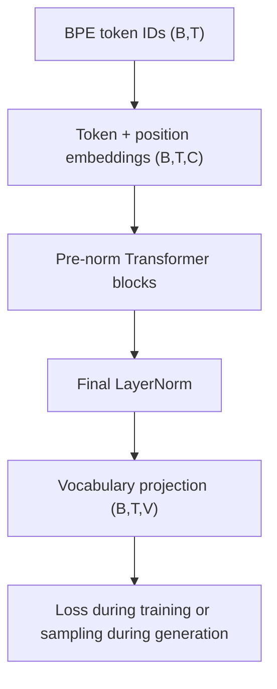

# Tiny GPT From Scratch

A compact decoder-only Transformer language model implemented from first principles with Python and PyTorch. The project covers the complete pipeline from raw text and byte-pair encoding (BPE) to causal self-attention, training, resumable checkpoints, autoregressive generation, and controlled experiments.

The model is trained on the Tiny Shakespeare corpus and intentionally kept small so that every stage can be inspected and understood.

## Highlights

- Byte-level BPE tokenizer implemented without an external tokenizer library
- Token and learned positional embeddings
- Causal scaled dot-product self-attention
- Multi-head attention with output projection
- Pre-normalized Transformer blocks with residual connections
- GELU feed-forward networks
- Next-token cross-entropy training with AdamW
- Training and validation loss estimation
- Resumable model and optimizer checkpoints
- Greedy, temperature, and top-k generation
- Context-length and model-size experiments
- Loss, perplexity, throughput, and generation-quality analysis

## Architecture



Each Transformer block contains:

```text
x = x + MultiHeadAttention(LayerNorm(x))
x = x + FeedForward(LayerNorm(x))
```

The causal mask prevents a token from attending to future positions, making the model suitable for next-token generation.

## End-to-end pipeline

```text
Raw Shakespeare text
        ↓
Train/validation split
        ↓
Train byte-level BPE tokenizer
        ↓
Encode text into token-ID tensors
        ↓
Create input and shifted-target windows
        ↓
TinyGPT forward pass
        ↓
Cross-entropy loss and AdamW updates
        ↓
Checkpointed trained model
        ↓
Autoregressive text generation
```

## Project structure

```text
Tiny_GPT_From_Scratch/
├── artifacts/
│   ├── checkpoints/           # Saved model and optimizer states
│   └── tokenizer/             # BPE vocabulary and merge rules
├── data/
│   ├── raw/                   # Original Tiny Shakespeare text
│   └── processed/             # Splits and encoded token tensors
├── model/
│   ├── attention.py           # Causal and multi-head attention
│   ├── embeddings.py          # Token and positional embeddings
│   ├── feed_forward.py        # GELU feed-forward network
│   ├── transformer_block.py   # Pre-norm block and residual paths
│   ├── transformer.py         # Sequential Transformer stack
│   └── tiny_gpt.py            # Complete model, loss, and generation
├── tokenizer/
│   └── bpe.py                 # BPE training, encoding, and decoding
├── checkpoint.py              # Save and restore training state
├── compare_contexts.py        # Context-length comparison
├── compare_models.py          # Model-size comparison
├── dataset.py                 # Context windows and random batches
├── experiments.py             # Named experiment configurations
├── generate.py                # Sampling experiments
├── prepare_data.py            # Train/validation text split
├── prepare_tokens.py          # Encode and save corpus tensors
├── train.py                   # Training, evaluation, and checkpoints
└── train_tokenizer.py         # Train and verify the BPE tokenizer
```

## Core components

### Byte-level BPE tokenizer

The tokenizer begins with the 256 possible byte values and learns frequently occurring adjacent pairs. With a configured vocabulary size of 300, it learns 44 merged tokens in addition to the base byte vocabulary.

Important functions in `tokenizer/bpe.py`:

- `get_pair_counts()` counts adjacent token pairs.
- `merge_pair()` replaces occurrences of a selected pair.
- `train_bpe()` repeatedly merges the most frequent pair.
- `build_vocabulary()` maps token IDs back to byte sequences.
- `encode()` converts text into token IDs.
- `decode()` converts token IDs back into text.
- `save_tokenizer()` and `load_tokenizer()` persist tokenizer artifacts.

### Training examples

The corpus is stored as a one-dimensional tensor of token IDs. `dataset.get_batch()` samples random windows and creates shifted targets:

```text
Input:  [t0, t1, t2, t3]
Target: [t1, t2, t3, t4]
```

Every sequence position therefore acts as a next-token classification example.

### Decoder-only Transformer

The baseline model uses:

| Setting | Value |
|---|---:|
| Vocabulary size | 300 |
| Context length | 16 |
| Embedding size | 32 |
| Attention heads | 4 |
| Features per head | 8 |
| Transformer blocks | 3 |
| Parameters | 57,900 |

Tensor shapes through the model:

```text
Token IDs:                 (B,T)
Token + position vectors:  (B,T,C)
Transformer output:        (B,T,C)
Vocabulary logits:         (B,T,V)
Targets:                   (B,T)
Cross-entropy loss:        scalar
```

## Setup

Clone the repository:

```bash
git clone https://github.com/awichauhan/Tiny_GPT_From_Scratch.git
cd Tiny_GPT_From_Scratch
```

Create and activate a virtual environment:

```bash
python3 -m venv venv
source venv/bin/activate
```

Install the dependencies:

```bash
python -m pip install --upgrade pip
pip install torch numpy
```

The project was developed with Python 3.11.

## Prepare the data and tokenizer

Place the Tiny Shakespeare corpus at:

```text
data/raw/tiny_shakespeare.txt
```

Create the training and validation text splits:

```bash
python prepare_data.py
```

Train and verify the BPE tokenizer:

```bash
python train_tokenizer.py
```

Encode both corpus splits and save them as PyTorch tensors:

```bash
python prepare_tokens.py
```

Generated artifacts include:

```text
artifacts/tokenizer/merges.json
artifacts/tokenizer/vocabulary.json
data/processed/train_tokens.pt
data/processed/validation_tokens.pt
```

## Train the model

Available experiments are defined in `experiments.py`.

```bash
python train.py --experiment context_8
python train.py --experiment context_16
python train.py --experiment context_32
python train.py --experiment medium_model
```

Training performs:

1. Random batch sampling
2. Forward propagation
3. Next-token cross-entropy calculation
4. Backpropagation
5. AdamW parameter updates
6. Periodic train/validation evaluation
7. Throughput reporting
8. Checkpoint saving

Each experiment writes to a separate checkpoint:

```text
artifacts/checkpoints/context_8.pt
artifacts/checkpoints/context_16.pt
artifacts/checkpoints/context_32.pt
artifacts/checkpoints/medium_model.pt
```

If a checkpoint exists, training restores:

- Model parameters
- Optimizer state
- Training step
- Model configuration
- Latest metrics
- PyTorch random-number-generator state

A completed experiment is not silently trained beyond its configured target step.

## Generate text

Run the sampling comparison:

```bash
python generate.py
```

Generation supports:

- Greedy/argmax decoding
- Temperature-controlled sampling
- Top-k filtering
- Fixed random seeds for reproducible comparisons

At every generation step, the model:

1. Keeps the latest context window.
2. Calculates vocabulary logits.
3. Uses only the final position’s logits.
4. Selects or samples one token.
5. Appends that token to the sequence.
6. Repeats until the requested length is reached.

The tokenizer uses safe replacement decoding for generated byte sequences. This prevents incomplete UTF-8 byte predictions from crashing generation.

## Run the comparisons

Compare context lengths under identical sampling settings:

```bash
python compare_contexts.py
```

Compare the small and medium models:

```bash
python compare_models.py
```

## Results

All context experiments used:

- 2,000 training steps
- 256 next-token targets per step
- The same embedding size
- The same number of attention heads
- The same number of Transformer blocks
- The same vocabulary and learning rate

Throughput values were measured locally on CPU and are environment-specific.

### Context-length comparison

| Context | Batch | Parameters | Validation loss | Perplexity | Tokens/s |
|---:|---:|---:|---:|---:|---:|
| 8 | 32 | 57,644 | **3.2092** | **24.76** | 39,398 |
| 16 | 16 | 57,900 | 3.2765 | 26.48 | 43,717 |
| 32 | 8 | 58,412 | 3.2922 | 26.90 | **46,183** |

Observations:

- Context 8 achieved the lowest validation loss under the limited training budget.
- Context 32 produced the strongest dialogue and punctuation structure in the inspected sample.
- A longer context provides more potential information, but a small model may require more capacity or training to use it effectively.
- Higher measured throughput for the longer contexts reflects hardware efficiency at this small scale. It does not remove attention’s quadratic scaling with context length.

### Model-size comparison

| Metric | Small model | Medium model |
|---|---:|---:|
| Context length | 16 | 16 |
| Embedding size | 32 | 64 |
| Transformer blocks | 3 | 4 |
| Parameters | 57,900 | 239,020 |
| Validation loss | 3.2765 | **2.9750** |
| Perplexity | 26.48 | **19.59** |
| Training throughput | **43,717 tokens/s** | 27,836 tokens/s |

The medium model:

- Used 4.13 times as many parameters
- Reduced validation loss by `0.3015`
- Reduced perplexity by approximately 26%
- Processed approximately 36% fewer tokens per second
- Produced more structured generated text

The experiment changes both width and depth, so it measures overall model capacity rather than isolating the effect of either one.

### Sampling comparison

| Strategy | Observed behavior |
|---|---|
| Greedy | Deterministic but entered a repetitive `I I I...` loop |
| Temperature 0.5 | More conservative and repetitive |
| Temperature 0.8 | Better diversity/coherence balance |
| Temperature 1.2 | Noisier output and occasional invalid bytes |
| Temperature 0.8 + top-k 20 | Best overall balance for these checkpoints |

### Example medium-model generation

Prompt:

```text
ROMEO:
```

Generated excerpt:

```text
ROMEO: bre:
Sids many, bly subo's your grawh abe
As that with ry mive;
As atte nose.

QUCENTETHES:
Ioth gee that at they mentrend you hounce.

DUCOMIO:
Now, I have a could you eew a ploager.
```

The text remains imperfect, as expected for a 239K-parameter model trained for only 2,000 steps. However, it demonstrates learned speaker formatting, punctuation, line structure, and Shakespeare-like token patterns.

## What this project demonstrates

- How raw text becomes byte-level BPE token IDs
- Why input and shifted-target sequences create next-token supervision
- How query, key, and value projections produce contextual representations
- Why causal masking is required for decoder-only generation
- How residual connections and LayerNorm stabilize Transformer blocks
- How vocabulary projection converts contextual features into token logits
- How autograd, cross-entropy, and AdamW train the network
- Why validation loss is required alongside training loss
- How complete training state can be saved and resumed
- How decoding strategy changes repetition, diversity, and text quality
- How context length and model capacity affect loss and throughput

## Project status

- [x] Data preparation and train/validation split
- [x] Byte-level BPE tokenizer
- [x] Token tensors and shifted training windows
- [x] Causal single-head attention
- [x] Multi-head attention
- [x] Token and positional embeddings
- [x] Feed-forward network
- [x] LayerNorm and residual connections
- [x] Transformer stack and vocabulary projection
- [x] Cross-entropy training with AdamW
- [x] Validation tracking
- [x] Resumable checkpoints
- [x] Autoregressive generation
- [x] Sampling comparison
- [x] Context-length comparison
- [x] Model-size comparison

This repository is an educational implementation intended to make every important stage of a GPT-style language model visible and understandable.